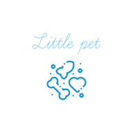
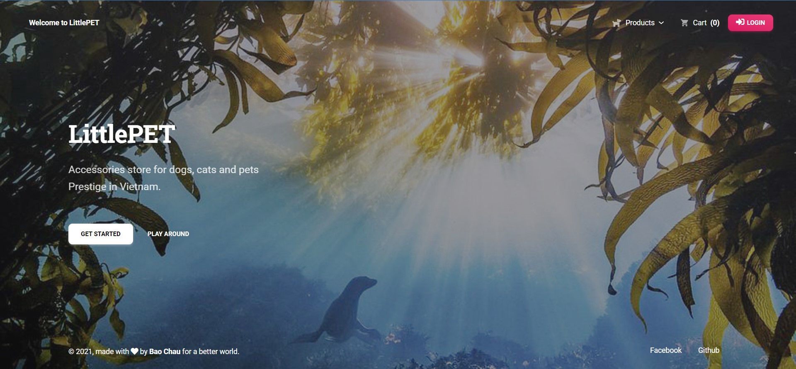
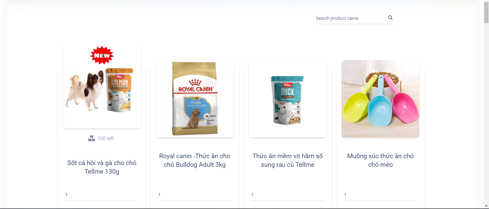
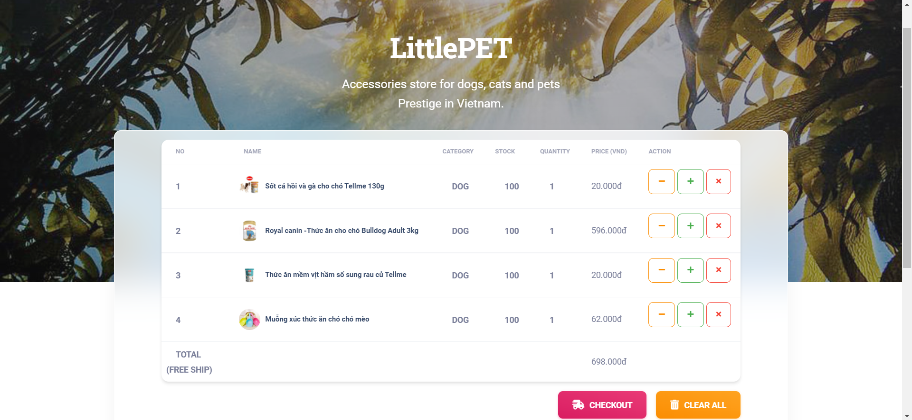
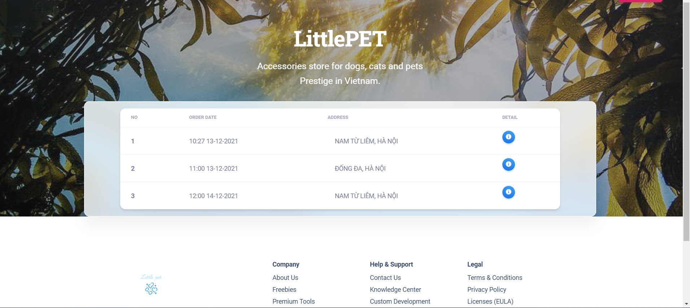
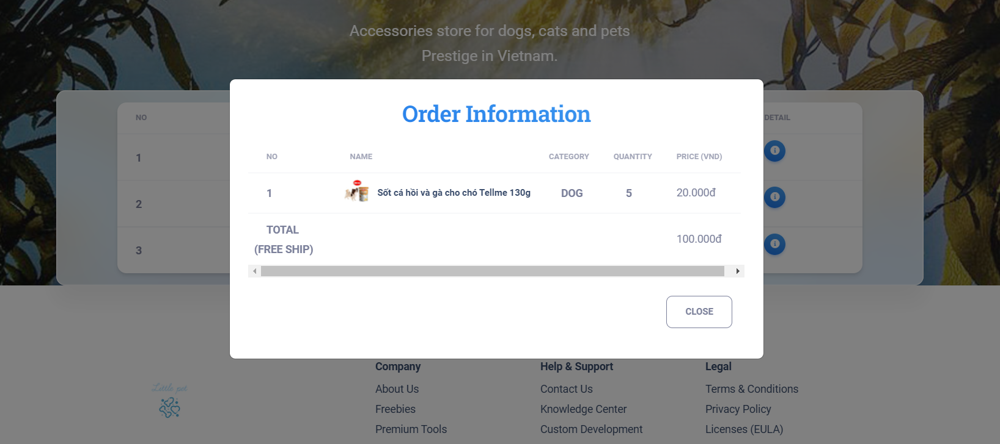
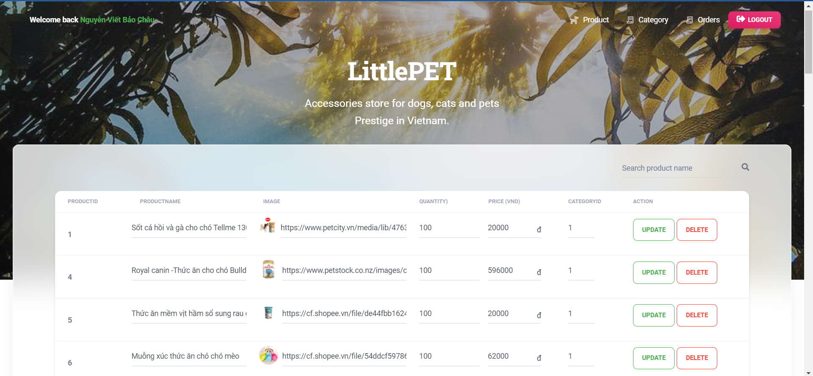

#  LittlePET

**Note**: This application uses heroku free tier for production so it's maybe slow when startup, please be patient.

## What is LittlePET?
- It's a shopping cart application for selling pet accessories.
- This web application also contains Admin role for manage stock, category, etc...Therefore, if you find some security issues that can break in to my Admin account, please contact me, I will be very appreciate.
- This application is also my assignment project for my school subject PRJ301 - Java Web Application Development, `mentor: BANTQ`.
- Work well on Desktop only.

## Technology
- Frontend
  - JSTL - Standard Tag Library for JSP
  - Bootstrap 5 - A popular CSS Framework
  - Material Kit 2 - Free & Open Source Web UI Kit
- Backend
  - Servlets - A Java class that extends the capabilities of the servers
  - Log4j - A separate implementation with powerful logging features
  - JDBC - A Java API to connect and execute the query with the database
  - SQLServer2008 - A relational database management system developed by Microsoft

## Some preview images
&nbsp;
&nbsp;
&nbsp;

## How to run
- I built this application with Netbean 8.2 so maybe you can use Netbean IDE to make it more easily to import project.
- If you use other IDE such as Eclipse or Intellij IDEA, you will need to find the way to config this project before use.
- After import this project to IDE, adding JSTL support (almost all IDE support adding JSTL lib) and all external library in `Lib_jar_files`.
- Then, you will need to change username and password in `DBContext` which match with your SQLServler.
- Finally, setup database with my `database.sql` scripts.
- That's all, enjoy LittlePET!.

# License & copyright

© Bao Chau Bong, FPT University Hoa Lac
